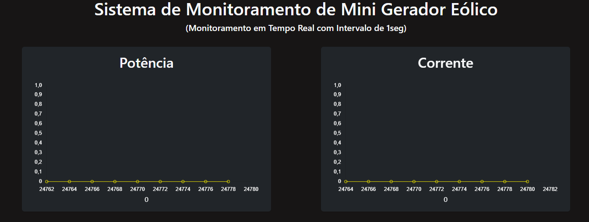
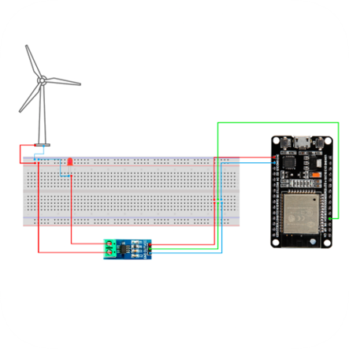

# 🌬️ Painel de Monitoramento de Mini Aerogerador

Este projeto é um painel em tempo real para monitoramento de um **mini aerogerador**, desenvolvido com **Node.js**, **Express** e **WebSocket (Socket.io)**. Ele coleta dados como **voltagem**, **corrente**, e outras métricas enviadas por um microcontrolador **ESP-WROOM-32 (DOIT ESP32 DEVKIT V1)** e exibe em um painel web.

## ⚠️ Importante

- 🔌 **O servidor embarcado no ESP32 deve estar ligado e funcionando para que o painel exiba os dados.**
- 📡 **Você deve subir o código que está na pasta `servidorsistemademonitoramento` para a sua placa ESP32 usando a IDE do Arduino.**
- 🌐 **Após subir, copie o IP que aparecer no monitor serial da IDE** (por exemplo, `192.168.1.7`) e **altere o código no Node.js**, substituindo na linha do `axios.get(...)`:


## 🚀 Tecnologias Utilizadas

- Node.js
- Express
- Socket.io
- ESP32 (ESP-WROOM-32)
- Sensor de Tensão ACS712
- HTML, CSS, JavaScript

---

## 📡 Como Funciona

1. O ESP32 coleta dados do mini aerogerador (voltagem, corrente, etc.).
2. Os dados são enviados via HTTP para o servidor Node.js.
3. O servidor transmite os dados via WebSocket para o navegador.
4. O painel web atualiza em tempo real com os dados recebidos.

---

## 🧪 Instalação

1. Clone o repositório:
```bash
git clone https://github.com/jabsonDevElias/sistemademonitoramentominiaerogerador.git
cd sistemademonitoramentoniniaerogerador
```

2. Instale as dependências:

```bash 
npm install
````

3. Inicie o servidor:

```bash 
node server.js
````

4. Acesse o painel:

```bash 
http://localhost:9999
````


Esquema para usar na sua placa:
---

---


